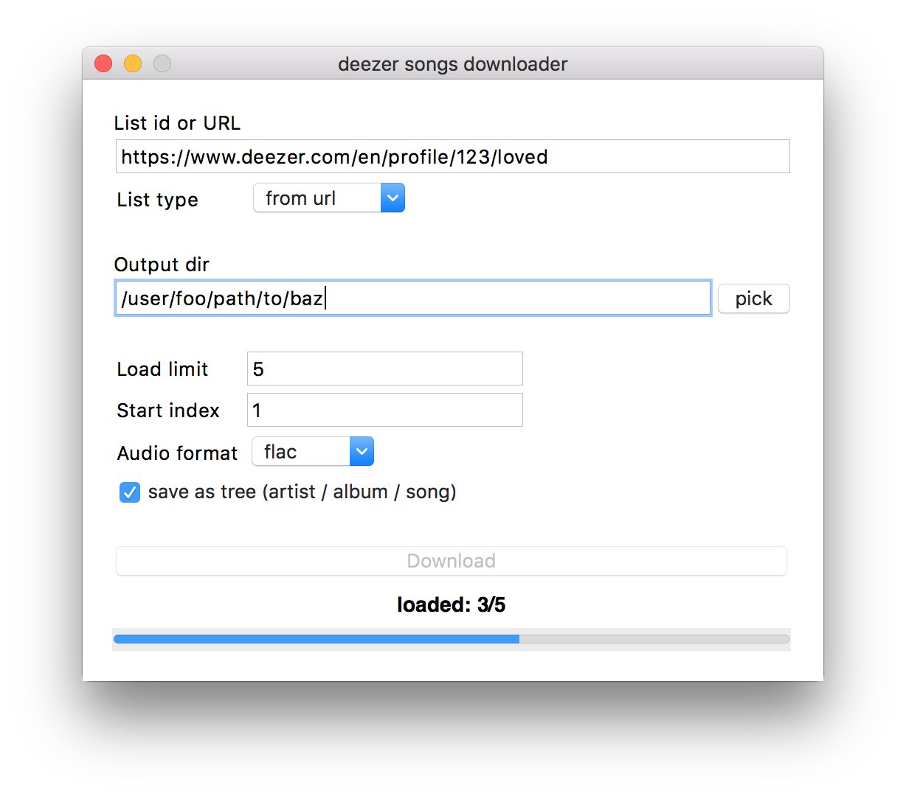

# deezload

Utility for downloading playlists, albums and favorite tracks from deezer.


## install

```bash
pip install deezload
```

### os x
```bash
brew search ffmpeg
```
### [another systems](https://github.com/adaptlearning/adapt_authoring/wiki/Installing-FFmpeg)


## usage

### gui

```bash
deezload
```




### command line

```bash
# basic
deezload 123  # will load playlist with id=123
deezload -t album 123
deezload album/123
deezload https://www.deezer.com/en/album/123

# load album
deezload https://www.deezer.com/en/album/123

# load playlist
deezload https://www.deezer.com/en/playlist/123

# load favorite tracks
deezload https://www.deezer.com/en/profile/123
deezload https://www.deezer.com/en/profile/123/loved

# load one track
deezload https://www.deezer.com/en/track/123

# load artist's top tracks
deezload https://www.deezer.com/en/artist/123
```

help:
```
usage: cmd.py [-h] [-t LIST_TYPE] [-i INDEX] [-l LIMIT] [-d] [-o OUTPUT_DIR]
              [-f FORMAT] [--tree] [--build BUILD]
              [list_id]

positional arguments:
  list_id        list id or resource URL

optional arguments:
  -h, --help     show this help message and exit
  -t LIST_TYPE   list type
  -i INDEX       start index
  -l LIMIT       load limit
  -d             debug mode
  -o OUTPUT_DIR  output directory
  -f FORMAT      output audio file format
  --tree         save files as tree: artist/album/song
  --build BUILD  build output path
```


### build standalone app

Build app. Check out output/dist/deezload* for executables.

```bash
deezload --build .
deezload --build path/to/build/output
```

## how it works

- parse deezer url and find appropriate api url
- fetch tracks from deezer
- search for each song on youtube
- download audio steam and convert into needed format
- restore songs metadata
- save files as tree (if specified)

### tree example
```
artist 1
	album 1
		song 1
		song 2
artist 2
	album 1
		song 1
	album 1
		song 1
```
